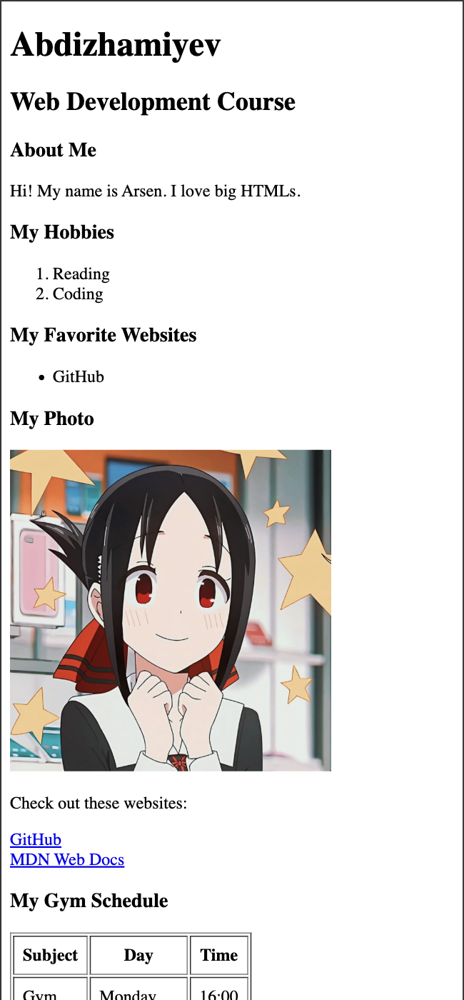
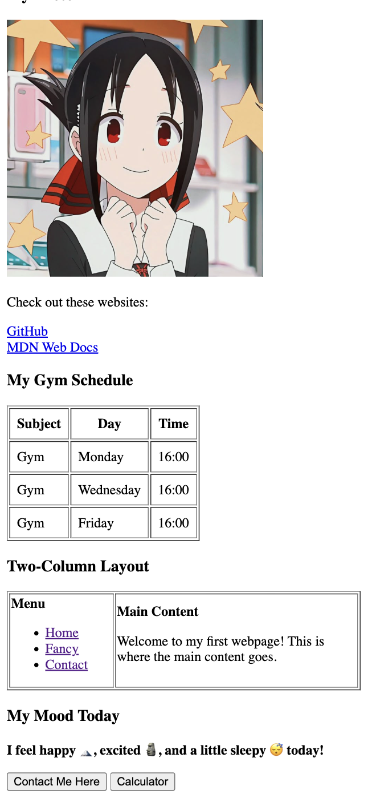
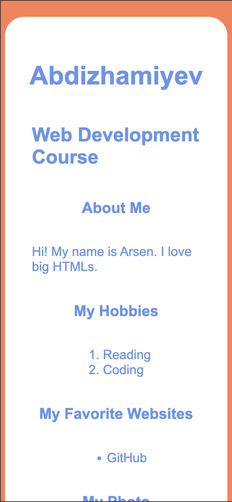
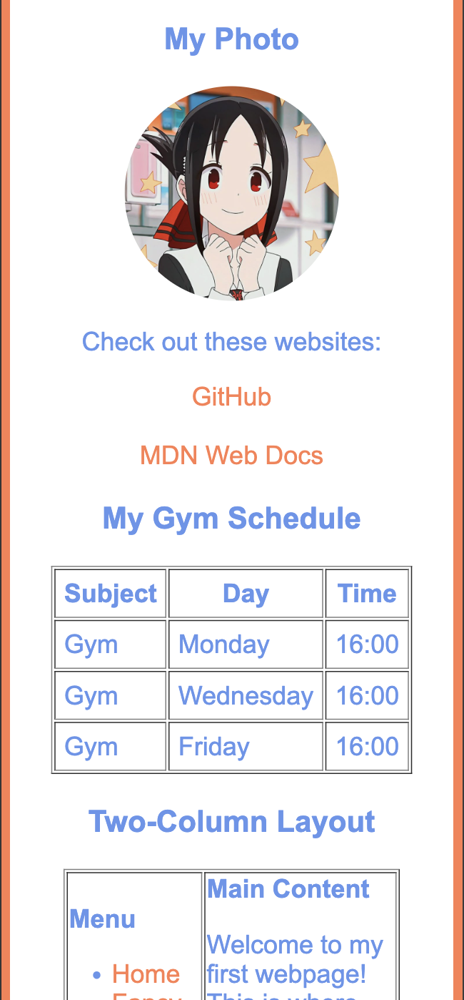
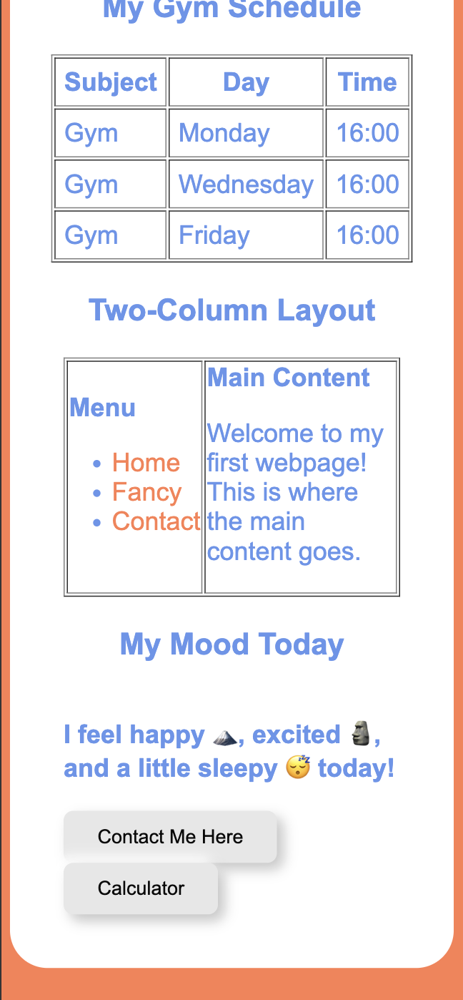

# CSS Practice Report

## 1. Introduction
This project demonstrates fundamental and intermediate CSS concepts by progressively styling HTML files in the `js-practice` folder. The tasks cover inline, internal, and external CSS, selectors, classes/IDs, favicons, divs, box model, positioning, sizing, float/clear, and a final report.

---

## 2. Tasks & Implementation

### Task 0: Intro to CSS
- Added styling to existing HTML files (`index.html`, `about-me.html`, `fancy.html`).

### Task 1: Inline CSS
- Used inline style to change the color of one paragraph (see `fancy.html`, static-box).

### Task 2: Internal CSS
- Defined CSS rules inside `<style>` tags in the `<head>` of `fancy.html` (backgrounds, positioning, float/clear).

### Task 3: External CSS
- Created `styles/style.css` and linked it in all HTML files.
- Moved reusable CSS rules (body, container, buttons, images, links) to this file.

### Task 4: CSS Syntax & Selectors
- Used element selectors (`p {}`), class selectors (`.container {}`), and ID selectors (`#main-heading {}`) in `style.css` and internal CSS.
- Applied different colors and fonts to demonstrate selector differences.

### Task 5: Classes vs. IDs
- Created `.highlight` class for multiple elements (can be seen in `style.css`).
- Created `#main-heading` ID for the main `<h1>` (usage can be added to `index.html`).

---

## Part 2: Intermediate CSS

### Task 6: Favicons
- Added favicon using `<link rel="icon" type="image/png" href="images/kaguya.jpeg">` in `index.html` and other files.

### Task 7: HTML Divs
- Used `
` to group content into sections (header, main, footer).
- Styled with background color and padding in `style.css`.

### Task 8: Box Model
- Added borders, margins, and padding to elements (see `.container`, `.static-box`, `.relative-box`, etc.).
- Experimented with different values for spacing effects.

### Task 9: CSS Positioning
- Created elements with static, relative, and absolute positioning in `fancy.html`.

### Task 10: CSS Sizing
- Used `px`, `%`, `em`, and `rem` units for headings, images, and layout (see `style.css` and HTML files).

### Task 11: Float and Clear
- Built a layout with two boxes floated left and right, and a clear box to fix overlap (`fancy.html`).

---

## 3. Screenshots
- Before applying CSS:

  
   

- After applying CSS:

  
  
   

---

## 4. Challenges & Solutions
- **Challenge:** Organizing CSS between inline, internal, and external styles.
  - **Solution:** Used inline for quick demos, internal for page-specific styles, and external for reusable styles.
- **Challenge:** Float/clear sometimes caused layout issues.
  - **Solution:** Used `.clear-box` with `clear: both` to fix overlapping.
- **Challenge:** Consistent styling across multiple HTML files.
  - **Solution:** Linked `style.css` in all files and used common classes.
- **Challenge:** Box model spacing was tricky.
  - **Solution:** Experimented with different `margin`, `padding`, and `border` values.

---

## 5. Conclusion
- All required CSS tasks were completed and demonstrated in the project files.
- The site is visually improved and demonstrates key CSS concepts.
- Screenshots show clear before/after results.
- The project is organized and ready for review.
