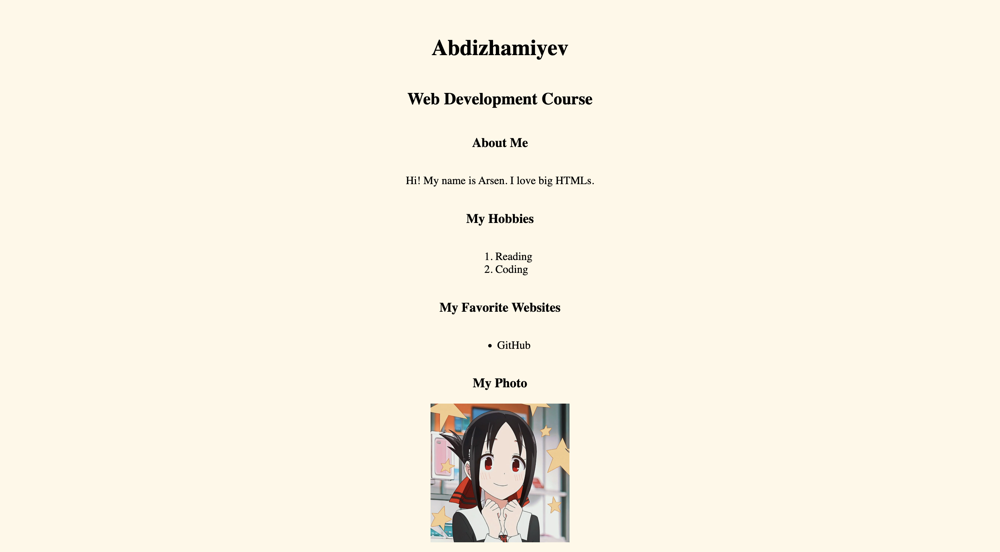
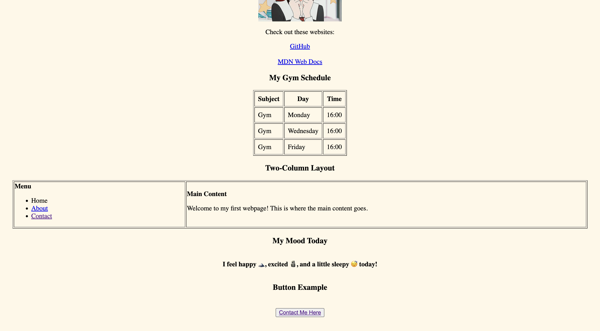
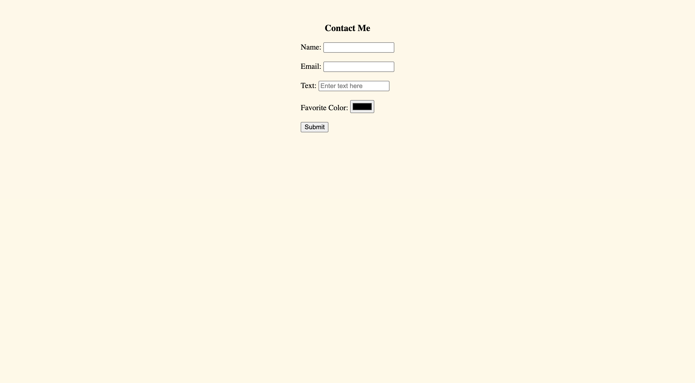

# Report: My First Webpage

## 1. Objective
The objective of this project was to create my first webpage using **HTML basics**.  
The tasks included learning and applying different HTML elements such as headings, paragraphs, lists, images, links, buttons, tables, emojis, and forms.  
Finally, the goal was to **publish the webpage online** using GitHub Pages or Netlify.

---

## 2. Steps Taken

### Step 0: Basic HTML Structure
- Created a new file named `index.html`.
- Added HTML boilerplate (`<!DOCTYPE html>`, `<html>`, `<head>`, `<title>`, `<body>`).
- Set the title as **"Arsenskii Portfolio"**.

### Step 1: Structured Text
- Used `<h1>`, `<h2>`, and `<h3>` for name, course, and "About Me".
- Added a paragraph `
` with a short introduction.

### Step 2: Lists
- Created an **ordered list (`<ol>`)** for hobbies.
- Created an **unordered list (`<ul>`)** for favorite websites.

### Step 3: Images and Links
- Inserted a photo using ``.
- Added clickable links `<a>` to favorite websites.

### Step 4: Buttons
- Added a button labeled **"Contact Me"**.

### Step 5: Tables
- Built a **class schedule table** with columns for Subject, Day, and Time.

### Step 6: Layout with Table
- Created a simple two-column layout:  
  - Left column = menu.  
  - Right column = main content.  

### Step 7: Emojis
- Added emojis inside a paragraph about my mood.

### Step 8: Forms
- Created a form with the following inputs:
  - Name (text input)
  - Email (email input)
  - Favorite Color (color input)
  - Submit button

### Step 9: Publishing
- Uploaded the project to **GitHub**.
- Enabled **GitHub Pages** to make the website public.

---

## 3. Screenshots

---

## 4. Reflection
Through this project, I learned:
- How to structure text with headings and paragraphs.
- The difference between ordered and unordered lists.
- How to add images and hyperlinks in HTML.
- How to create tables both for data and simple layouts.
- How to build a form with different input types.
- The process of publishing a website using GitHub Pages or Netlify.

This was NOT my **first step into web development**, BUT and I now understand the importance of proper HTML structure for accessibility and readability.  

---

## 5. Conclusion
The project was successful:  
- The webpage runs without errors.  
- All required HTML elements were implemented.  
- The site is published and accessible online.  
